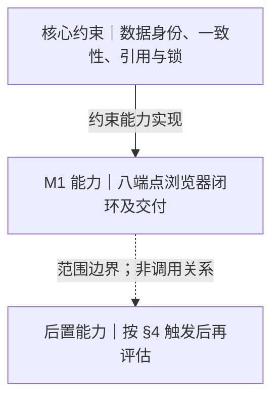

# M1-SPEC

> **定稿权**：M1 的用户行为、纳入与排除、后置触发条件、可测验收目标以本文件为唯一定稿处。本文件**不得覆盖** [[ADR-0001-项目启动与技术栈裁决]]：范围、技术方向、不可变约束以 ADR 为准。字段与约束见 [[06-M1-数据契约]]，接口形态见 [[05-M1-接口契约]]，运行参数见 [[07-M1-运行手册]]，门槛与证据见 [[08-M1-验收规范]]。
> **性质**：规范（契约），只定义行为，不写实施断言。进度与证据从 [[M1-任务表]] 推导。

## 1 目标与使用边界

M1 是**单机、单用户、局域网**可用的最小闭环，含最小浏览器界面：上传、列表／搜索、详情、下载、回收站查看／还原／清空；视觉打磨后置。界面同源调用既有 API，不新增业务接口或鉴权。范围以 ADR §二为准。

| 边界 | 口径 |
|---|---|
| 部署形态 | 单机单用户、局域网可用；M1 不做鉴权，接口不鉴权（多用户／外网触发后另立契约） |
| 上传形态 | 单文件、multipart；不做目录导入、分片、断点续传、客户端秒传 |
| 存储形态 | 数据库只存元数据，文件本体只落文件系统；内容寻址、相同内容只存一份 |
| 删除形态 | 软删进回收站，写固定到期时刻；物理字节按保护引用延迟回收 |
| 规模目标 | 面向 TB/PB 规模，增量优先，不频繁全量扫描 |

## 2 用户场景与需求

每条需求写：能力、触发、输入、可见结果、失败行为。需求 ID 为稳定 ID，引用格式 `[[03-M1-SPEC#^req-m1-01]]`。

- **REQ-M1-01 浏览器上传单个文件**。触发：用户在界面选择并提交一个文件。输入：`multipart/form-data`，字段 `file`，必填、单文件。可见结果：资源创建成功并出现在列表，返回资源标识与「是否复用存储」信息。失败行为：缺参／格式错误返回 `INVALID_ARGUMENT`；超过单文件上限返回 `PAYLOAD_TOO_LARGE`；服务忙返回 `SERVICE_BUSY` 且明确可重试。 ^req-m1-01
- **REQ-M1-02 后端流式接收并计算摘要**。触发：上传请求到达。输入：文件字节流。可见结果：服务端边接收边计算 SHA-256，不把完整文件读入内存；摘要作为内容身份的一部分落库。失败行为：接收或摘要失败时不产生可见资源，残留由对账收敛。 ^req-m1-02
- **REQ-M1-03 保存资源／内容／位置记录与基础元数据**。触发：上传受理。输入：原始文件名、字节数、MIME 类型、导入时间、基础标签、摘要与算法。可见结果：资源记录、内容身份、位置记录三者分离且相互引用；字节数字段统一 `size_bytes`（JSON `sizeBytes`）。失败行为：任何一步不成立则不提交元数据，不得出现可见的半条记录。 ^req-m1-03
- **REQ-M1-04 资源列表与分页**。触发：打开资源列表或翻页。输入：分页参数（默认 `page=1`、`size=20`）。可见结果：返回当前页资源、总数与分页回显。失败行为：参数非法返回 `INVALID_ARGUMENT`；回收站中的资源不出现在普通列表。 ^req-m1-04
- **REQ-M1-05 文件名与标签检索**。触发：按文件名或标签查询。输入：`name`（文件名包含匹配，大小写不敏感）、`tag`。可见结果：返回命中集合，分页规则同列表。失败行为：不引入独立检索引擎，也不做正文全文／语义检索。 ^req-m1-05
- **REQ-M1-06 资源详情**。触发：打开某个资源。输入：资源 ID。可见结果：展示原始文件名、`sizeBytes`、类型、导入时间、标签、Hash 与内容关联。失败行为：ID 不存在返回 `RESOURCE_NOT_FOUND`；回收站中的资源对普通详情不可见。 ^req-m1-06
- **REQ-M1-07 下载与浏览器原生预览**。触发：下载或预览。输入：资源 ID；预览时带 `inline=1`。可见结果：下载字节与上传时摘要一致；`inline=1` 时浏览器原生可预览的类型内联展示；不自研格式解析器。失败行为：资源不存在或已硬删返回 `RESOURCE_NOT_FOUND`；字节缺失不得返回空文件。 ^req-m1-07
- **REQ-M1-08 相同内容复用（一份物理内容、多条逻辑引用）**。触发：上传的内容与已有内容身份一致且校验通过。输入：同摘要、同大小、字节一致。可见结果：默认**新建一条资源引用**，不新增物理字节；响应 `deduplicated=true` 并给出 `contentId`，复用提示信息随响应返回，M1 浏览器显示「已复用存储」。失败行为：不拒绝、不合并、不新增物理副本。 ^req-m1-08
- **REQ-M1-09 哈希冲突拒绝与审计留痕**。触发：命中的内容身份在大小或字节上不一致。输入：本次临时字节与既有内容身份。可见结果：**先比大小、再逐字节**，两步都在移动文件之前完成；不一致时拒绝写入、返回 `CONTENT_CONFLICT`、记录冲突审计，原内容行与其物理字节不动。失败行为：任何情况下不得覆盖既有字节、不得把异大小当复用。 ^req-m1-09
- **REQ-M1-10 删除资源＝软删进回收站**。触发：用户删除一条资源。输入：资源 ID。可见结果：资源写入软删时刻与固定到期时刻（默认保留 7 天，可配置、测试可为 0），从普通列表／详情消失并进入回收站；只删引用，物理内容保留。失败行为：已硬删目标返回 `RESOURCE_NOT_FOUND`；重复软删幂等，不刷新首次到期时刻。 ^req-m1-10
- **REQ-M1-11 回收站查看、还原与清空**。触发：打开回收站、还原某条、清空回收站。输入：分页参数；清空必须带显式确认标记 `confirm=true`。可见结果：回收站列表另带 `deletedAt`／`expireAt`；还原清除两个时刻回到活跃列表；清空返回 `deletedCount`。失败行为：清空缺确认返回 `INVALID_ARGUMENT` 且不删除任何内容；已硬删目标还原返回 `RESOURCE_NOT_FOUND`。 ^req-m1-11
- **REQ-M1-12 延迟回收 GC 与对账**。触发：启动完成对账后、每小时 GC、每日对账。输入：待回收内容队列与存储树。可见结果：保护引用归零的内容按「置待回收 → 删文件 → 置已回收」三段提交，文件已缺可幂等完成；对账覆盖临时文件、孤儿字节、缺失字节三类。失败行为：字节与内容地址不符时**不删除、不置已回收**，留待人工复核。 ^req-m1-12
- **REQ-M1-13 Docker Compose 交付与持久化**。触发：在新环境启动交付态。输入：编排与挂载配置。可见结果：`docker compose up` 可启动应用与数据库；重启后资源、元数据与物理内容仍可读取；数据库用 named volume，字节用独立 bind mount。失败行为：首次初始化必须「起库 → 人工按序执行当前全部批准迁移（现 V1→V2）→ 构建 JAR → 启动应用」，禁止空库降级。 ^req-m1-13
- **REQ-M1-14 单写者启动门与版本化迁移台账**。触发：应用启动。输入：数据库会话锁与数据根文件锁；迁移脚本集合。可见结果：拿到两把锁才允许写；启动只读核对版本集合、脚本摘要与关键结构。失败行为：失锁即停写并以退出码 2 结束；结构核对不符即拒启并以退出码 3 结束，无降级开关。 ^req-m1-14

### 最小浏览器用户故事（2026-09-25 L4）

| 价值与场景 | 成功验收 | 失败验收 | 需求／验收 |
|---|---|---|---|
| 收纳文件：选文件上传，重复内容时辨认存储复用 | 成功后可在普通列表找到；复用有提示 | 上传错误可读，重复提交受控 | REQ-M1-01／08／09；ACC-UI、ACC-HTTP |
| 找到并使用：浏览列表、按名称／标签搜索、看详情并下载 | 结果可打开详情，下载字节摘要一致 | 加载、空列表、检索／下载错误有明确状态 | REQ-M1-04～07；ACC-UI、ACC-HTTP |
| 管理删除：从回收站查看、还原或清空 | 还原回普通列表；清空前二次确认 | 取消清空不发请求；错误提示且不重复提交 | REQ-M1-10／11；ACC-UI、ACC-HTTP |

## 3 能力边界（可替换 / 不可触碰）

替换判据：替换后数据库既有数据仍自洽、且不需要数据迁移 → 可替换；否则属不可变量。逐条评审替代方案时对照本表。

| 需求 | 可替换的部分 | 不可触碰的不变量 |
|---|---|---|
| REQ-M1-01 | Web 框架、multipart 解析库、上限数值（默认 2GB 可配置） | 单文件口径、内容寻址、先落临时文件后取锁、移动前校验 |
| REQ-M1-02 | 摘要库、分块大小、读法 | 摘要必须落库（算法＋摘要＋大小）、不得整文件读入内存 |
| REQ-M1-03 | ORM 选型、标签存储形态、MIME 判定方式 | 三表分离、内容身份唯一约束、位置只存相对存储键 |
| REQ-M1-04／05 | 查询写法、索引策略、模糊匹配是否启用扩展 | 不得引入独立检索引擎／正文全文检索 |
| REQ-M1-06／07 | 传输方式（整读／流式）、响应头细节 | 下载字节与上传摘要一致；不自研格式解析器 |
| REQ-M1-08 | 计数实现、响应字段组装 | 默认新建引用；不加冗余计数列、不加唯一约束；保护引用含回收站行 |
| REQ-M1-09 | 比较实现、审计写入方式 | 先比大小再比字节、两步前置到移动之前、原行原字节不动、不新增冲突态 |
| REQ-M1-10／11 | 到期扫描实现、清空交互 | 软删＋固定到期、二次确认、保护引用含回收站行、无第二保留期 |
| REQ-M1-12 | 调度实现、回收频率、保留期取值 | 只删引用、归零才置待回收、三段提交且幂等、字节不符不盲删 |
| REQ-M1-13 | 编排细节、镜像基线、卷命名 | 两轨统一 PG17／DDL／内容键／配置语义／排序规则；初始化顺序与禁空库降级 |
| REQ-M1-14 | 脚本组织方式、核对实现 | 人工执行业务退出、DDL 与记账同事务、脚本只增不改、只读核对不符即拒启、无降级开关 |

### 产品分层（M1）

本图按「核心约束／M1 能力／后置能力」归类，不表示软件调用顺序或当前实现状态。判定时先看是否承载 ADR 的数据与一致性不变量；只有 ADR §二明确纳入的能力属于 M1，其余不得凭相似用途自动归入 M1，按本页 §4 的触发条件评估。范围冲突以 ADR 为准。

| 层级 | 边界 | 对应内容 |
|---|---|---|
| 核心约束 | M1 能力不得突破；变更须先改 ADR | Resource／Content／Location 身份与字节分离；临时落盘、校验、原子移动、事务与对账的一致性链；冲突拒绝与原字节保护；软删、含回收站行的保护引用及归零后延迟回收；锁和迁移拒启协议。见 ADR §三～§八、本页 §3。 |
| M1 能力 | 必须交付并按相应验收项核对，具体实现可在约束内调整 | 单文件流式上传、元数据与基础标签、列表／文件名与标签搜索、详情、下载／原生基础预览、内容复用、软删、回收站查看／还原／清空、GC 与对账、Compose 交付，以及同源的最小浏览器界面。浏览器调用现有八端点完成「上传 → 列表／搜索 → 详情 → 下载校验 → 删除进回收站 → 还原」，另验证二次确认后清空；视觉打磨后置。见 ADR §二、本页 §2、05 §3、08 §2.1。 |
| 后置能力 | 不因出现在图中而进入 M1 排期；满足触发条件后另行评估 | NAS 存量接管、目录导入、分片／断点续传与客户端秒传；独立搜索引擎／正文或语义检索；相似检测／AI；分享、多用户权限、外网；完整格式预览／编辑／插件；P2P、多中心、微服务和 Kubernetes。触发条件及第一动作见本页 §4。 |

界面同源调用 05 §3 既有八端点，不新增接口、鉴权或架构层。

## 4 排除项与后置触发

未满足触发条件的条目**不进排期**，也不得以「顺手做一下」提前落地；涉及数据模型的一律先改 ADR。

| 排除项 | 后置 | 触发条件（可观测） | 触发后第一动作 |
|---|---|---|---|
| 接管 NAS 存量资源 | 不进 M1 | 出现「接管已有历史资源库」的真实需求 | 先写扫描与增量识别专项调研，不直接改 M1 数据模型 |
| 目录／文件夹导入 | M2 | 出现「一次导入一个文件夹」的真实需求，且单文件闭环已通过一次完整回归 | 同 NAS 存量，先做扫描与增量识别调研 |
| 分片上传／断点续传 | M2 | 单文件经常接近或超过 2GB，或在不稳定网络下真实出现上传失败 | 先定「分片摘要与合并后内容键」口径，必须仍落到同一内容身份 |
| 客户端秒传预检（precheck） | M2 | 客户端先行算摘要的成本经评估通过，且已具备逐字节校验与限流／鉴权 | 仅保留路由与触发条件（[[05-M1-接口契约]] §4）；请求响应、鉴权限流均未裁决，落地时另立 M2 契约 |
| 独立搜索引擎／正文全文检索 | M2～M3 | 用户真实提出「按正文内容找文件」 | 直接采用 Meilisearch，不先尝试分词扩展等中间替代方案 |
| 相似检测／音视频理解／AI 能力 | M4 之后 | 出现明确的相似内容治理需求，且内容库规模足以支撑样本 | 立项前先做收益评估 |
| 分享／多用户权限／外网访问 | M4 之后 | 出现真实的多人使用场景 | 先做鉴权＋限流＋权限模型设计，再谈开放访问 |
| 完整格式预览／编辑／插件市场 | M4 之后 | 出现明确的编辑类需求 | 立项前先做竞品对照 |
| P2P／多中心／微服务／Kubernetes | 不在 M1～M4 活跃排期 | 出现多节点编排与高可用的真实需求，或 P2P 被列为第一阶段硬需求 | 重新做技术选型比较，不在现有模型上打补丁 |

## 5 验收目标

需求映射到验收门槛 ID；门槛的测试步骤只在 [[08-M1-验收规范]] 定义，本页不复制。

| 需求 | 主要验收 ID |
|---|---|
| REQ-M1-01／02／03／08／09 | ACC-G3（去重语义）、ACC-G4（中断一致性）、ACC-HTTP（真实 HTTP） |
| REQ-M1-04／05／06／07 | ACC-G1（元数据规模）、ACC-G2（大文件流式导入）、ACC-HTTP |
| REQ-M1-10／11／12 | ACC-G5（引用与回收）、ACC-G4、ACC-HTTP |
| REQ-M1-13／14 | ACC-G6（部署与迁移）、ACC-G4 |

## 6 契约依赖

- 接口：[[05-M1-接口契约]]（八端点、请求响应、错误体、分页）。
- 数据：[[06-M1-数据契约]]（五表、字段、约束、状态转换、审计枚举）。
- 架构：[[04-M1-架构与计划]]（模块、上传七分支、六类共锁、GC 三段提交、启动退出码）。
- 运行：[[07-M1-运行手册]]（配置键、双模式、双轨部署、迁移、备份恢复、GC 与对账）。
- 验收：[[08-M1-验收规范]]（六门槛、故障矩阵、HTTP 验收、证据格式）。

## 7 澄清入口

以下问题只登记关联条目，处理状态从 [[M1-任务表]] 的澄清与偏离视图读取。

CL-T6 已于 2026-09-22 关闭；逐格定义见 [[08-M1-验收规范#^clt6-cells]]，门槛执行仍须按原矩阵。

上轮批准设计 I1～I8 已全部落入各契约页并收敛：`revived` 内部语义、冲突审计可空字段、两层物理键、GC 双周期告警、环境变量映射、需求编号 `req-m1-01..14` 与跨页集成均已定稿，不再作为待拍板事项；HTTP 夹具属实现任务（要求见 [[08-M1-验收规范]] §2），不是待定契约。
